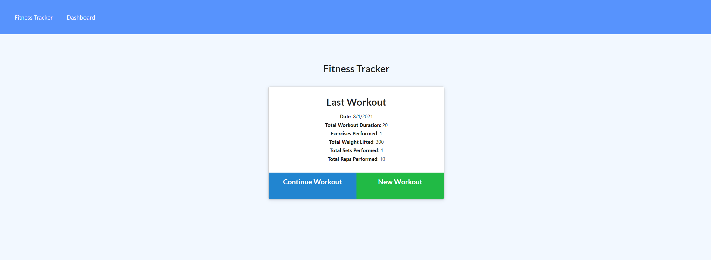
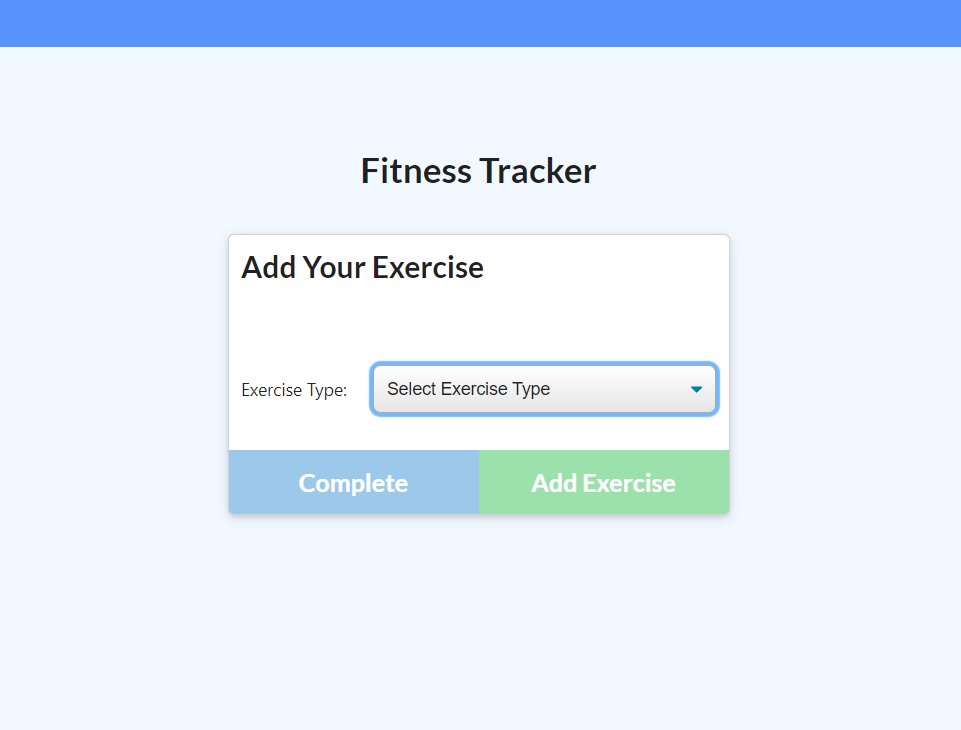
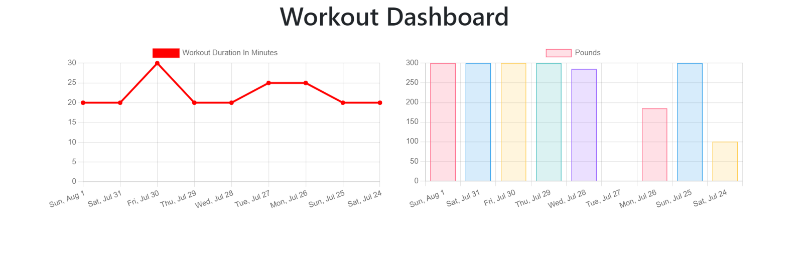

# Workout-Tracker

## Overview
This is a workout page that allows you to track and make exercises. Users can create their own workout and set the type, duration, reps, weight, etc. of each workout.

## Installation
1. Run npm i
2. Run npm run seed
3. Run npm start

## Instructions
1. You'll be greeted with a home page.

2. Select add exercise and you'll be prompted with the following page.

3. You can also click dashboard to have an overview of your workouts.
